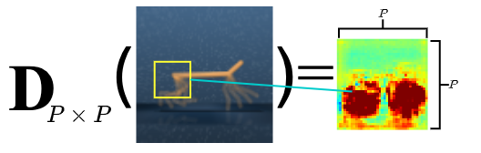
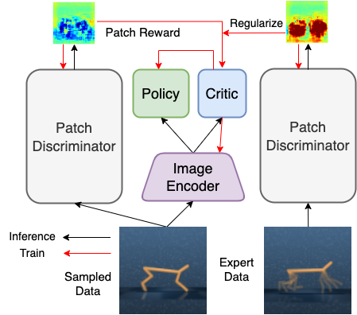

# PatchAIL: Visual Imitation with Patch Rewards

This is a repository containing the code for the paper ["Visual Imitation with Patch Rewards"](https://arxiv.org/).




## Download DMC expert demonstrations, weights and environment libraries [[link]](https://osf.io/4w69f/?view_only=e29b9dc9ea474d038d533c2245754f0c)
The link contains the following:
- The expert demonstrations for all tasks in the paper.
- The weight files for the expert (DrQ-v2) and behavior cloning (BC).
- The supporting libraries for environments (Gym-Robotics, metaworld) in the paper.
- Extract the files provided in the link
  - set the `path/to/dir` portion of the `root_dir` path variable in `cfgs/config.yaml` to the path of the `PatchAIL` repository.
  - place the `expert_demos` and `weights` folders in `${root_dir}/PatchAIL`.
- Atari games:
  - Download pkl files from [[link](https://drive.google.com/file/d/1I2wTuIFLaX_5wD7DI_QME2oYTJDBHiWb/view?usp=sharing)]
  or
  ```python generate_atari_rlunplugged.py```.


## Instructions
- Install [Mujoco](http://www.mujoco.org/) based on the instructions given [here](https://github.com/facebookresearch/drqv2).
- Install the following libraries:
  ```
  sudo apt update
  sudo apt install libosmesa6-dev libgl1-mesa-glx libglfw3
  ```
- Install dependencies
  - Set up Environment (Conda)
  ```
  conda env create -f conda_env.yml
  conda activate vil
  ```
  - Set up Environment (Pip)
  ```
  pip install -r requirement.txt
  ```
- (If you want to run Atari games) Install Atari ROMS:
  ```
  pip install ale-py
  ale-import-roms path_to_ROMS
  ```
- Main Imitation Experiments (Observations only) (10 exp trajs) - Commands for running the code on the DeepMind Control Suite, for pixel-based input
  - Train PatchAIL (w.o. Reg) agent on DMC
    ```
    python train.py agent=patchirl suite=dmc obs_type=pixels suite/dmc_task=finger_spin algo_name=patchairl_ss num_demos=10 seed=1 replay_buffer_size=150000
    ```
  - Train PatchAIL (w.o. Reg) agent on Atari
    ```
    python train.py agent=patchirl suite=atari obs_type=pixels suite/atari_task=pong algo_name=patchairl num_demos=20 seed=1 replay_buffer_size=1000000
    ```

  - Train PatchAIL-W agent
    ```
    python train.py agent=patchirl_simreg suite=dmc obs_type=pixels suite/dmc_task=finger_spin algo_name=patchairl_ss_weight num_demos=10 seed=1
    ```

  - Train PatchAIL-B agent
    ```
    python train.py agent=patchirl_simreg suite=dmc obs_type=pixels suite/dmc_task=finger_spin algo_name=patchairl_ss_bonus num_demos=10 seed=1 reward_scale=0.5 agent.sim_rate=auto-0.5 +agent.sim_type="bonus"
    ```

  - Train Shared-Encoder AIL agent
    ```
    python train.py agent=encirl_ss suite=dmc obs_type=pixels suite/dmc_task=finger_spin num_demos=10 seed=1 algo_name=encairl_ss reward_type=airl replay_buffer_size=150000 
    ```

  - Train Independent-Encoder AIL agent
    ```
    python train.py agent=ind_encirl_ss suite=dmc obs_type=pixels suite/dmc_task=finger_spin num_demos=10 seed=1 algo_name=ind_encairl_ss reward_type=airl replay_buffer_size=150000 
    ```

  - Train BC agent
    ```
    python train.py agent=bc suite=dmc obs_type=pixels suite/dmc_task=walker_run num_demos=10
    ```

- Visual Imitation with Actions (1 exp traj)
  - Train PatchAIL (w.o. Reg) agent
    ```
    python train.py agent=patchirl suite=dmc obs_type=pixels suite/dmc_task=finger_spin algo_name=patchairl_ss_bc num_demos=10 seed=1 replay_buffer_size=150000 bc_regularize=true suite.num_train_frames=1101000
    ```

  - Train PatchAIL-W agent
    ```
    python train.py agent=patchirl_simreg suite=dmc obs_type=pixels suite/dmc_task=finger_spin algo_name=patchairl_ss_weight_bc num_demos=1 seed=1 bc_regularize=true suite.num_train_frames=1101000
    ```

  - Train PatchAIL-B agent
    ```
    python train.py agent=patchirl_simreg suite=dmc obs_type=pixels suite/dmc_task=finger_spin algo_name=patchairl_ss_bonus_bc num_demos=1 seed=1 reward_scale=0.5 agent.sim_rate=auto-0.5 +agent.sim_type="bonus" bc_regularize=true suite.num_train_frames=1101000
    ```

  - Train Shared-Encoder AIL agent
    ```
    python train.py agent=encirl_ss suite=dmc obs_type=pixels suite/dmc_task=finger_spin num_demos=1 seed=1 algo_name=encairl_ss_bc reward_type=airl replay_buffer_size=150000  bc_regularize=true suite.num_train_frames=1101000
    ```

  - Train Independent-Encoder AIL agent
    ```
    python train.py agent=ind_encirl_ss suite=dmc obs_type=pixels suite/dmc_task=finger_spin num_demos=1 seed=1 algo_name=ind_encairl_ss_bc reward_type=airl replay_buffer_size=150000 bc_regularize=true suite.num_train_frames=1101000
    ```

  - Train ROT
    ```
    python train.py agent=potil suite=dmc obs_type=pixels suite/dmc_task=walker_run bc_regularize=true num_demos=1 replay_buffer_size=150000 suite.num_train_frames=1101000 algo_name=rot
    ```
- If you want to resume experiments from previous experiment:
    ```
    python train.py ...(use the same parameters that you want resume) +resume_exp=true
    ```
    This will load models from the snapshot of previous log directory.

- Monitor results
```
tensorboard --logdir exp_local
```

Ack: This repo is based on the [ROT](https://github.com/siddhanthaldar/ROT/) repo.
